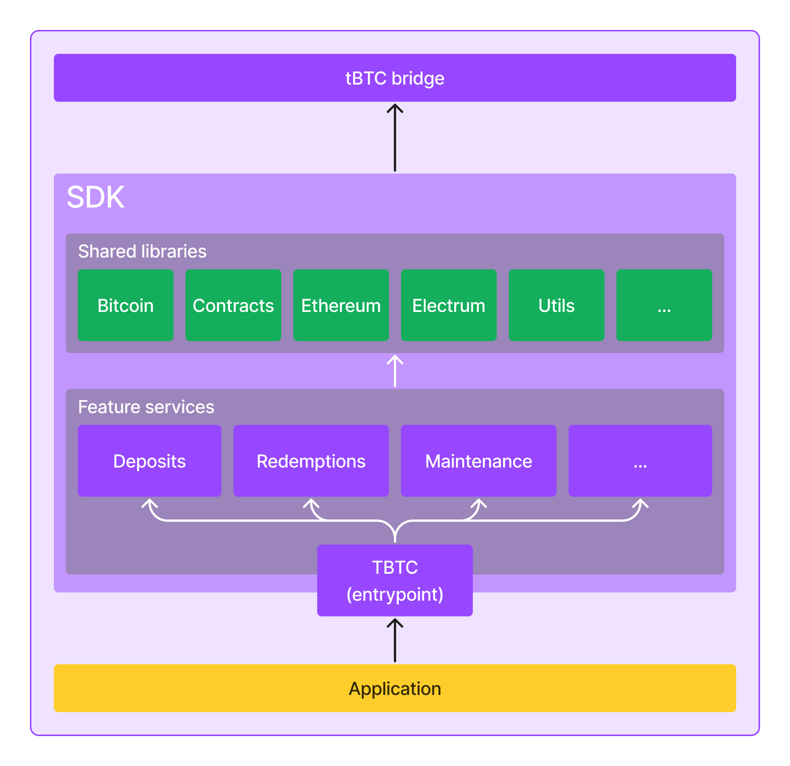

# Architecture

The following diagram presents the architecture of the tBTC SDK and its place in the ecosystem:

<figure><figcaption>
tBTC SDK Architecture
</figcaption></figure>

As you can see, the SDK consists of several major parts:

* `TBTC` component
* Feature services
* Shared libraries

### `TBTC` component

The `TBTC` component is the main entry point to the SDK. It provides different ways to initialize the SDK that are supposed to address the common use cases (see [initialize-sdk.md](guides/initialize-sdk.md "mention") guide to learn more). Moreover, the `TBTC` component gives access to the SDK core features through feature services as well as low-level direct access to the underlying tBTC smart contracts and Bitcoin network client.

### Feature services

The role of the SDK feature services is to provide seamless access to the core features of the tBTC bridge. The most important feature services of the SDK are:

* **Deposits:** exposes the tBTC v2 deposit and mint flow for BTC depositors
* **Redemptions:** exposes the tBTC v2 unmint and redeem flow for TBTC redeemers&#x20;
* **Maintenance:** exposes authorized maintenance actions for maintainers (e.g. optimistic minting guardians)

### Shared libraries

Shared libraries are reusable modules that provide cross-cutting concerns leveraged by multiple feature services and the `TBTC` component. The main shared libraries of the SDK are:

* **Bitcoin**: interfaces and utilities necessary to interact with the Bitcoin chain
* **Contracts**: chain-agnostic interfaces allowing to interact with tBTC smart contracts
* **Electrum**: Electrum-based implementation of the Bitcoin client
* **Ethereum**: implementations of tBTC smart contract interfaces for Ethereum chain
* **Utils**: general utility functions
