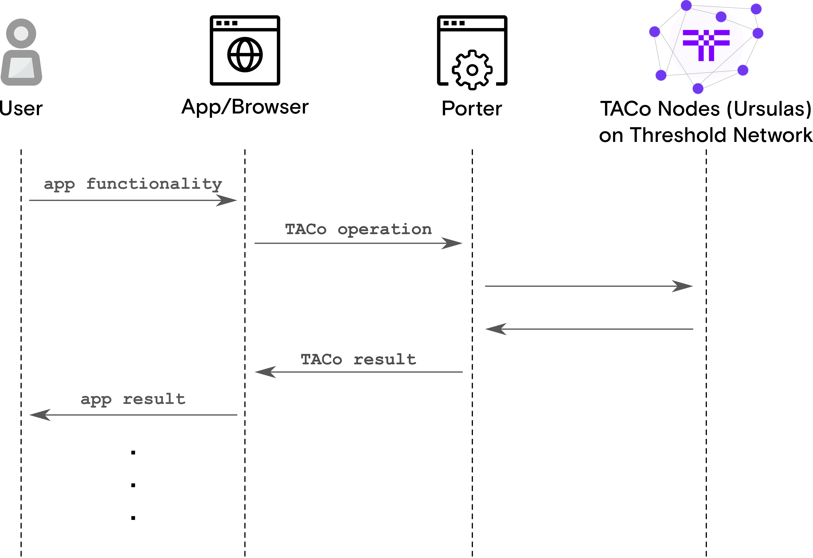

# Porter

## Overview

Porter can be described as the _“Infura for TACo”_. Porter is a web-based service that performs TACo-based protocol operations for applications.

Its goal is to simplify and abstract the complexities surrounding the TACo protocol to negate the need for applications to interact with it via a Python client. Porter introduces the TACo protocol to cross-platform functionality, including web and mobile applications.

<figure><figcaption></figcaption></figure>

Any publicly available Porter can be used to interface with the Threshold Network, or some application developers opt to [run their own](porter.md#running-a-porter-instance).

## Public Porter Instances

Public Porter instances are operated by centralized entities and have different security properties than user-operated instances. If you're interested in running your own Porter, see  [#running-a-porter-instance](porter.md#running-a-porter-instance "mention")

To use the default Porter URIs in `taco`, run:

```typescript
import { domains, getPorterUri } from '@nucypher/taco';

const porterUri = getPorterUri(domains.MAINNET);  // mainnet
// OR
const devPorterUri = getPorterUri(domains.DEV);  // lynx testnet
// OR
const testnetPorterUri = getPorterUri(domains.TESTNET);  // tapir testnet
```

Alternatively, you can use your own non-default Porter URIs.

## Running a Porter Instance


Managing a Porter instance on `mainnet` is more involved than operating a mainnet node, requiring solid server administration skills. This includes understanding how to provision and secure servers, applying security best practices, and maintaining consistent system performance. Key competencies like network configuration, SSL/TLS encryption, and CORS, are also essential to ensure the secure and efficient operation of your Porter instance.



By default, Porter runs over HTTP. However, Porter instances must be secured with a valid HTTPS certificate in order to be compatible with network applications.  A Porter instance running without SSL/TLS is not only insecure but also browser-based apps and websites will be unable to connect.

To secure your Docker-run Porter instance with HTTPS, use a reverse proxy like [Nginx](https://docs.nginx.com/nginx/admin-guide/web-server/reverse-proxy/) or [Apache](https://httpd.apache.org/docs/2.4/ssl/ssl\_howto.html) for SSL processing, and potentially [Let's Encrypt](https://letsencrypt.org/) for automated SSL certificate issuance and renewal. Additionally, consider using cloud-based services like AWS/Digital Ocean load balancers or Cloudflare for SSL termination and enhanced security.


### Security Considerations

* **HTTPS:** To run the Porter service over HTTPS, it will require a TLS key and a TLS certificate.
* **CORS:** Allowed origins for [Cross-Origin Resource Sharing (CORS)](https://en.wikipedia.org/wiki/Cross-origin\_resource\_sharing)
* **Authentication:** Optional usage restriction (non-public instance) via authentication protocols, e.g. basic authentication, etc. if desired

### Run via Docker

1.  Get the latest `porter` image

    ```bash
    $ docker pull nucypher/porter:latest
    ```
2.  Run Porter HTTP Service on port 80

    ```bash
    $ docker run -d \
    --name porter \
    -v ~/.local/share/nucypher/:/root/.local/share/nucypher:rw \
    -p 80:9155 \
    --restart=unless-stopped \
    nucypher/porter:latest \
    nucypher-porter run \
    --eth-endpoint https://<ETH ENDPOINT URI> \
    --polygon-endpoint https://<POLYGON ENDPOINT URI> \
    --domain <TACO DOMAIN>
    ```

    The command above is for illustrative purposes and can be modified as necessary.&#x20;
3. Porter will be available on default port 80 (HTTP)
4.  View Porter logs

    ```bash
    $ docker logs -f porter
    ```
5.  Stop Porter service

    ```bash
    $ docker stop porter
    ```


View the [Porter Github repos](https://github.com/nucypher/nucypher-porter) for more information.

