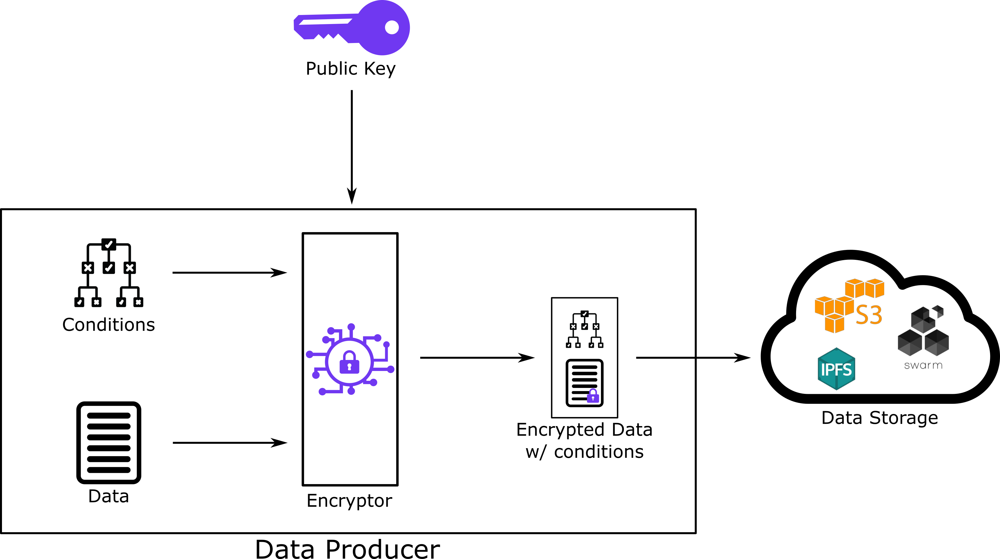
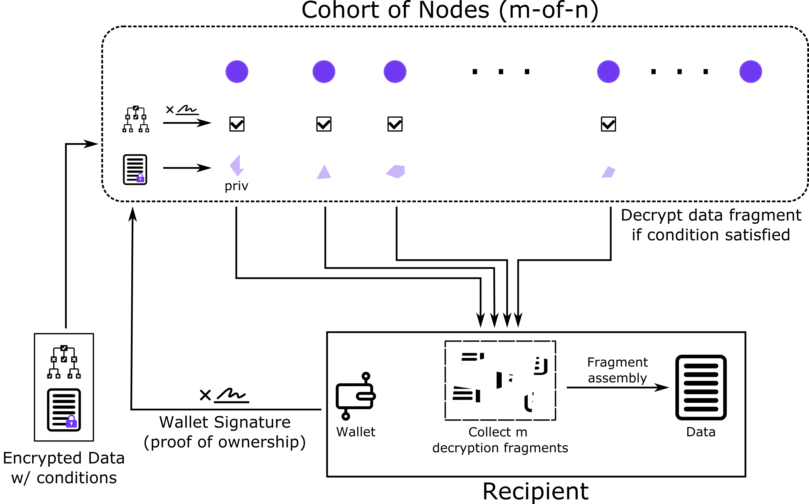

# Key Concepts

**Threshold Decryption**

Under the hood, TACo involves splitting a joint secret – a decryption key – into multiples _shares_ and distributing those among authorized and collateralized node operators (stakers in the Threshold network). A minimum number – a _threshold_ – of those operators holding the key shares must be online and actively participate in partial decryptions. These are subsequently combined on the requester's client to reconstruct the original plaintext data.

<figure><figcaption>
Distributed Key Generation
</figcaption></figure>

**Conditionality**

Conditions are 'attached' on a per-ciphertext basis. In other words, each and every payload, message or bit can be access-restricted by a unique set of specified conditions. In most situations, condition sets will be automatically reused until the end-user proactively configures them – for example, in order to remove an address from continuing to access the messages in a group chat.\
\
A range of access condition types can be defined by the data owner. For example:

* EVM-based\
  _e.g. Does the requester own a given NFT?_
* RPC-driven\
  _e.g. Does the requester have at least X amount of a given token in their wallet?_
* Time-based\
  _e.g. Has a predefined period elapsed, after which requests will be ignored?_

These conditions are also composable and can be combined in any logical sequence or decision tree.

<figure><figcaption>
Encryption with Conditions
</figcaption></figure>

**Condition Fulfillment Verification**

In most use cases, requesters prove their association with condition fulfillment – i.e. their right to receive a threshold number of decrypting shares – by signing a transaction that verifies their ownership of a given Ethereum wallet. That wallet is checked for fulfillment of the specific condition – e.g. owning an NFT in order to access a DAO's knowledge base.

This signature can be cached by the application for a use case-appropriate period of time, such that the user does not have to repeatedly re-sign for access later. However, verification still takes place in the background – for example, if a wallet address is removed from an NFT-gated group-chat by dint of changing the access-granting NFT, they will immediately be unable to see new messages. The cached signature will not give them access any longer than is specified by the data owner/encryptor.

<figure><figcaption>
Condition Fulfillment Decryption
</figcaption></figure>

**Network Parameterization**

In forthcoming versions, developers will have the option to tweak certain network-level parameters, which affect the collusion-resistance, redundancy, latency and costs of using TACo. These parameters mostly pertain to each cohort of nodes tasked with key material management and condition verification:&#x20;

* The number of decrypting shares _n_\
  i.e. the size of the cohort&#x20;
* The frequency and/or business logic for replacing members of the cohort
* The 'hand-chosen' node address that will always feature in the cohort
* The sampling mechanism for selecting cohort members

This optionality can also be surfaced for end-users – for example, in the form of 'packages' that combine network-level parameters. End-users might choose between a few discrete options, based on their trust, risk and cost preferences.
