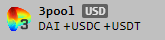
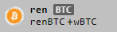

# B. Protocol

B. Protocol is a third-party decentralized backstop liquidity protocol aiming to make lending platforms more stable.&#x20;

### The problem

In Liquity Protocol there's a concept called "[Stability Pool](https://docs.liquity.org/faq/stability-pool-and-liquidations)". The purpose of the stability pool is to purchase liquidated collateral (tBTC) at a discount by using Threshold USD (thUSD) as payment.&#x20;

Users deposits thUSD into the stability pool and their funds are pooled with other depositors. If a pool consist of 900,000 thUSD and a user deposits 100,000 thUSD, that user is entitled to 10% of the collateral seized.&#x20;

The issue with stability pool is that as liquidations occurs, thUSD is traded to tBTC, but never back to thUSD. If left untouched, the pool will eventually only consist of tBTC and no further liquidations can take place against the pool. Furthermore, by acquiring tBTC collateral, the value for depositors in the pool becomes subject to the price of BTC.&#x20;

Users are therefore incentivized to quickly sell of the tBTC for thUSD to avoid taking on price risk, but in Liquity, this process is manual. Users have to manually open the UI and withdraw tBTC, sell it for thUSD and then re-deposit the thUSD. This is both a time consuming and gas costly operation, best suited for whales and users with their own bots.&#x20;

Even worse, a DAO cannot realistically operate in the current stability pool model because voting to move and sell funds becomes impractical, costly and slow.&#x20;

In order to establish a non-human, algorithmic, fully automated solution to compound profits we look to B.Protocol.&#x20;

### B.Protocol to the rescue

Instead of depositing directly into the stability pool, we can use B.Protocol's wrapping smart contract interface, which deposits the thUSD to the stability pool on behalf of all users (and the PCV).&#x20;

Once liquidation happens, the discounted tBTC is automatically offered for sale by B.Protocol’s Backstop AMM (B.AMM). This is done according to a deterministic formula, which takes into account the current tBTC and thUSD inventory, and the current BTC-USD market price (which is taken from Chainlink). Whenever the sale occurs, the smart contract deposits the returned thUSD back to the stability pool.

If there are no takers for the offer on the B.AMM, Gelato Keepers will arbitrage through popular DEX pairs to fulfill the order.&#x20;

This way the PCV becomes self-sufficient and able to operate indefinitely without outside interference.&#x20;

### Integration details

B.Protocol Team will deploy a non-upgradeable pool that is Threshold USD compatible.

The pool will be using Chainlink BTC/USD oracle (same as Threshold USD).

The pool will not deploy idle funds in any yield farming applications.&#x20;

Threshold USD PCV will whitelist the smart contract for the B.Protocol pool and the Threshold Network DAO (T DAO) will vote to initiate a deposit of thUSD to the B.Protocol pool. The deposit is moved from the PCV smart contract to B.Protocol and can be moved back to the PCV at any time, without limitation, as long as the T DAO votes to do so. If there is tBTC in the pool at the time of withdraw, the tBTC may also be transferred back to the PCV.&#x20;

The B.AMM contract's "A" parameter ("A" is amplification factor​​​, higher value means less slippage) is operated through a co-ownership between T DAO and B.Protocol, where B.Protocol propose "A" value and T DAO can approve or reject.

The discount rate is set to 4% on deployment, but the max rate should be configurable up to 10% in a joint governance mechanism between T DAO & B.Protocol. &#x20;

All profits from liquidations will auto-compound within the B. Protocol pool.&#x20;

**Keeper**

As a backup mechanism, B. Protocol will deploy [Gelato keepers](https://medium.com/gelato-network/introducing-gelato-v2-the-most-reliable-way-to-automate-your-ethereum-smart-contracts-73cd0010599e) that can route.

Example:​

`tBTC -> WBTC -> USDC -> thUSD`

In this case funds are routed through the following Curve Finance stable pools:

In addition, funds are routed through uniswap (v2 or v3) WBTC/USDC pools.&#x20;

Other routes could be:

`tBTC -> WBTC -> DAI -> thUSD`\
`tBTC -> WBTC -> USDT -> thUSD`

The keeper is funded by the DAO and any profit it makes is distributed back to the PCV.

​
