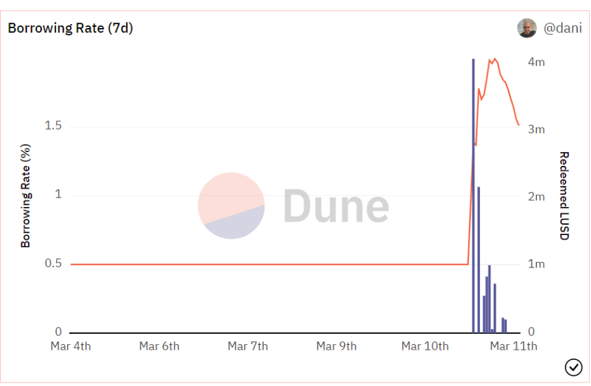

# Redemptions and thUSD Price Stability

## How does thUSD closely follow the price of USD?

The ability to redeem thUSD for tBTC at face value (i.e. 1 thUSD for $1 of tBTC) and the minimum collateral ratio of 110% create a price floor and price ceiling (respectively) through arbitrage opportunities. We call these "hard peg mechanisms" since they are based on direct processes.

thUSD also benefits from less direct mechanisms for USD parity — called "soft peg mechanisms". One of these mechanisms is parity as a Schelling point. Since Threshold USD treats thUSD as being equal to USD, parity between the two is an implied equilibrium state of the protocol. Another of these mechanisms is the borrowing fee on new debts. As redemptions increase (implying thUSD is below $1), so too does the baseRate — making borrowing less attractive which keeps new thUSD from hitting the market and driving the price below $1.

Liquity (on which thUSD Protocol is based on) did a thorough analysis on the price stability of LUSD[ here](https://www.liquity.org/blog/on-price-stability-of-liquity) ([https://www.liquity.org/blog/on-price-stability-of-liquity](https://www.liquity.org/blog/on-price-stability-of-liquity)). This analysis is equally relevant for thUSD.

## What are redemptions?

A redemption is the process of exchanging thUSD for tBTC at face value, as if 1 thUSD is exactly worth $1. That is, for x thUSD you get x Dollars worth of tBTC in return.

Users can redeem their thUSD for tBTC at any time without limitations. However, a redemption fee might be charged on the redeemed amount.

For example, if the current redemption fee is 1%, the price of tBTC is $50,000 and you redeem 10,000 thUSD, you would get 0.198 tBTC (0.2 tBTC minus a redemption fee of 0.002 tBTC).

Note that the redeemed amount is taken into account for calculating the base rate and might have an impact on the redemption fee, especially if the amount is large.

To illustrate how Redemptions work, below you can see the mechanism in action for LUSD, when its value went below 1 USD. The Borrowing rate (red line) immediately spiked from 0.5% up to around 1.8% and redemptions (blue bars) started to happen, i.e. users would buy LUSD at less than 1 USD and redeem for ETH in Vaults as if it was valued at 1 USD, arbitraging the difference, reducing the supply of LUSD and increasing its price.

<figure><figcaption>
Redemptions example
</figcaption></figure>

## Is a redemption the same as paying back my debt?

No, redemptions are a completely separate mechanism. All one has to do to pay back their debt is adjust their Vault's debt and collateral.

## How is the redemption fee calculated?

Under normal operation, the redemption fee is given by the formula (baseRate + 0.5%) \* tBTCdrawn

## How is the baseRate calculated?

Redemption fees are based on the baseRate state variable in Threshold USD, which is dynamically updated. The baseRate increases with each redemption, and decays according to time passed since the last fee event - i.e. the last redemption or issuance of thUSD.

Upon each redemption:

* _baseRate_ is decayed based on time passed since the last fee event
* _baseRate_ is incremented by an amount proportional to the fraction of the total thUSD supply that was redeemed
* The redemption fee is given by (_baseRate_  + 0.5%) \* tBTCdrawn

## As a borrower, do I lose money if I'm redeemed against?

If your Vault is redeemed against, you do not incur a net loss. However, you will lose some of your tBTC exposure. Your Vault's collateral ratio will also improve after a redemption.

## How can I avoid being redeemed against?

The best way to avoid being redeemed against is by maintaining a high collateral ratio relative to the rest of the Vault's in the system. Remember: The riskiest Vault (i.e. lowest collateralized Vaults) are first in line when a redemption takes place.

\
