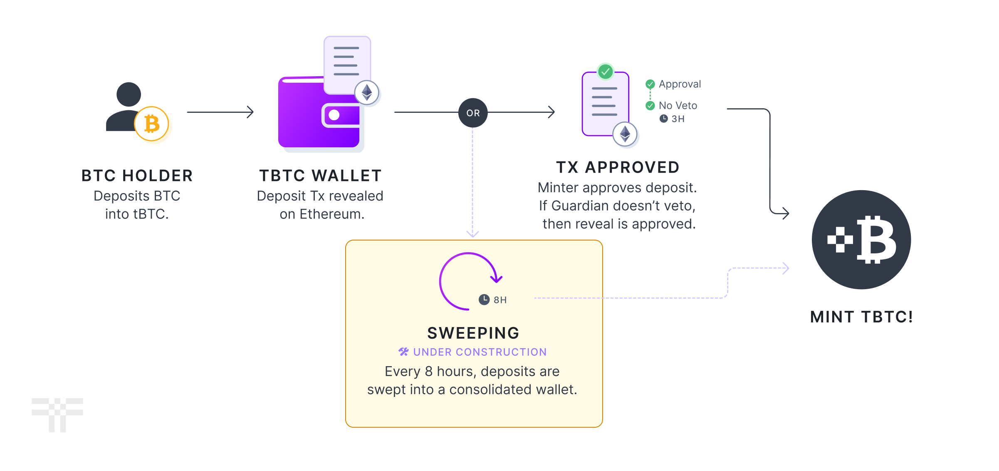

# The Path to Permissionlessness

The system was designed from the outset to be fully permissionless - anyone with the minimum amount of T stake, could run a node and have a [proportional chance](wallet-generation.md) of being a custodian.

In order to effectively ship the product, we launched with a permissioned set of Signers, as well as permissioned sets of Guardians and Minters. This document will explain the ideas behind those changes and what we're doing about it going forward.

## TL;DR

* We will make the Signer set permissionless after we have solved some technical obstacles.
* Minters and Guardians are here to stay, but will not be the only way to mint.

## Permissionless Custodianship

To select the 100 Signers for a wallet, we choose from the list of Beta Stakers instead of all Stakers. This decision was made for several reasons:

1. During the early days of the system; the testnet and [chaosnet](https://blog.threshold.network/tbtc-v2-hits-its-first-launch-milestone/) phases, it is important to ensure that the Stakers are available to help test changes and quickly respond to critical bugs. Having direct access to individuals known to the development team is critical in this context.
2. The underlying signature algorithm, [GG18](https://eprint.iacr.org/2019/114.pdf), cannot identify misbehaving signers.&#x20;

The point about GG18 is crucial. Without being able to identify misbehaving Stakers, a small, sophisticated, malicious minority can make it difficult to sign Bitcoin transactions in a timely manner. If we were able to identify the misbehaving signers, we could exclude them directly from the signing process.

Although alternative algorithms exist for identifying misbehaving signers, they are not yet viable for production use for one or more of the following reasons:

* They are not yet [production-ready](https://github.com/taurusgroup/multi-party-sig) codebases.
* They are not open source.
* They exist only as whitepapers.

To address this issue, we have been developing a proof-of-concept for [CGGMP](https://eprint.iacr.org/2021/060) and exploring [FROST](https://www.ietf.org/id/draft-irtf-cfrg-frost-12.html). Once we are confident in these areas, we will open up Custodianship to any staker running a node and staking the minimum amount of T. This will create a permissionless alternative to Optimistic Minting through the Guardians and Minters, albeit slightly slower.

## Guardians and Minters

Guardians and Minters will remain permissioned indefinitely, as they are a set of high-trust public operators with their reputations on the line. If we were to make these lists permissionless, a malicious Minter could flood the system with fake minting requests for the Guardians to deal with, or a malicious Guardian could veto every proposed mint to halt growth.

<figure><figcaption>
Optimistic Minting diagram for minting tBTC
</figcaption></figure>

If a Guardian or Minter misbehaves, the [Threshold DAO](https://threshold.network/governance) can vote to remove them.

<figure><figcaption>
Sweeping option for minting tBTC
</figcaption></figure>

Once sweeping is enabled and the Signers are permissionless, any deposit that all Minters refuse to approve or that a Guardian refuses to accept can still be minted every eight hours by the Signers. This ensures that the system remains resilient and able to handle situations in which a malicious actor attempts to disrupt the minting process.

