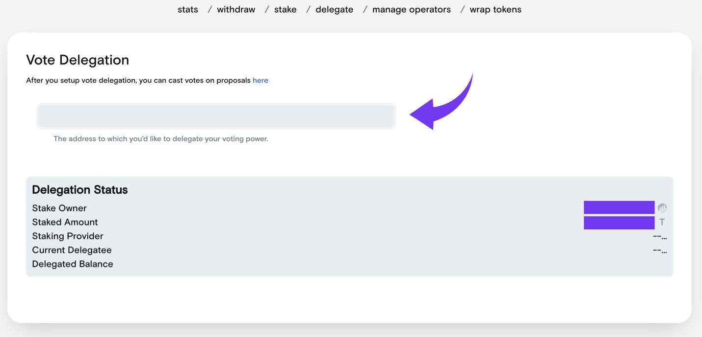
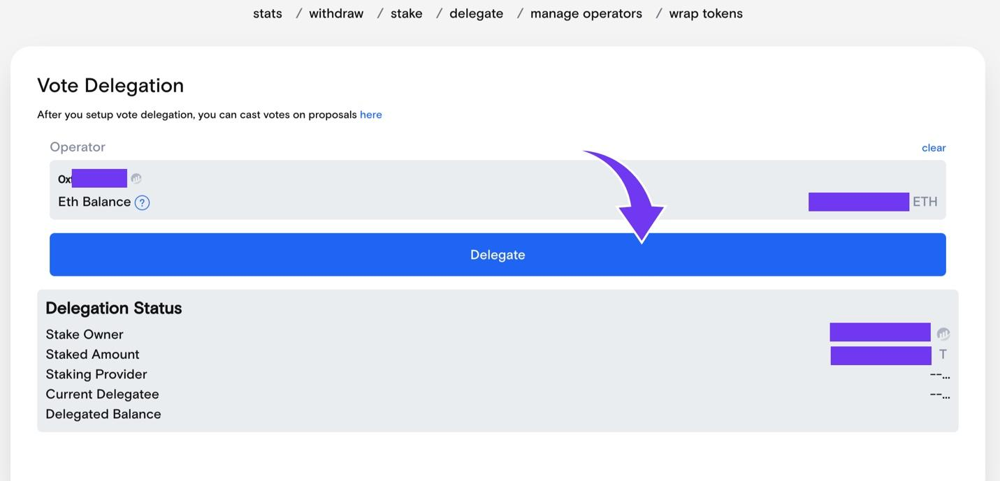

# Staked Token Delegation

Stakers on Threshold can delegate their stake weights to themselves or a third party for voting on governance proposals.


Delegation is accomplished via an on-chain transaction which costs ETH gas.


1. Go to [https://stake.nucypher.network/manage/delegate](https://stake.nucypher.network/manage/delegate)

2\. Connect your wallet

3\. Enter the delegate address - once an address is entered, a _“Delegate”_ button will appear

4\. Click _"Delegate"_ and sign the transaction.

