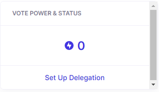
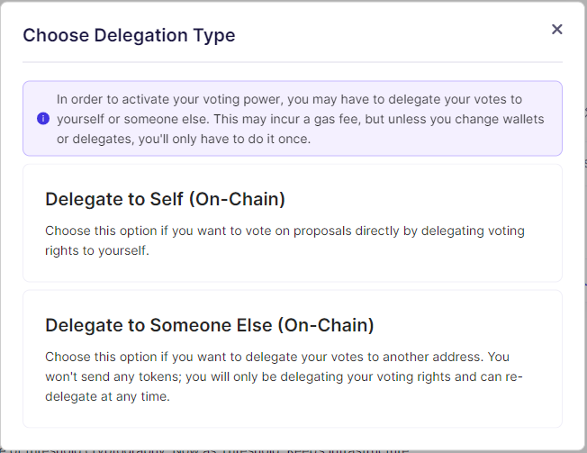
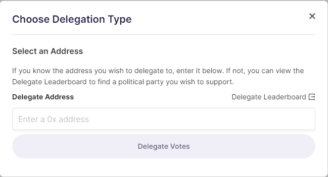

# Liquid Token Delegation

Liquid T holders who aren't staking on Threshold can delegate their token weights to themselves or a third party for voting on governance proposals.


Delegation is accomplished via an on-chain transaction which costs ETH gas.


1. Go to [https://boardroom.io/threshold](https://boardroom.io/threshold)

2\. Connect your wallet

3\. Click "_Set Up Delegation"_

4\. Select your _"Delegation Type"_ - either to yourself or a third party.

5\. Enter _"Delegate Address"_ and click on _"Delegate Votes"_

6\. Sign the transaction

****
