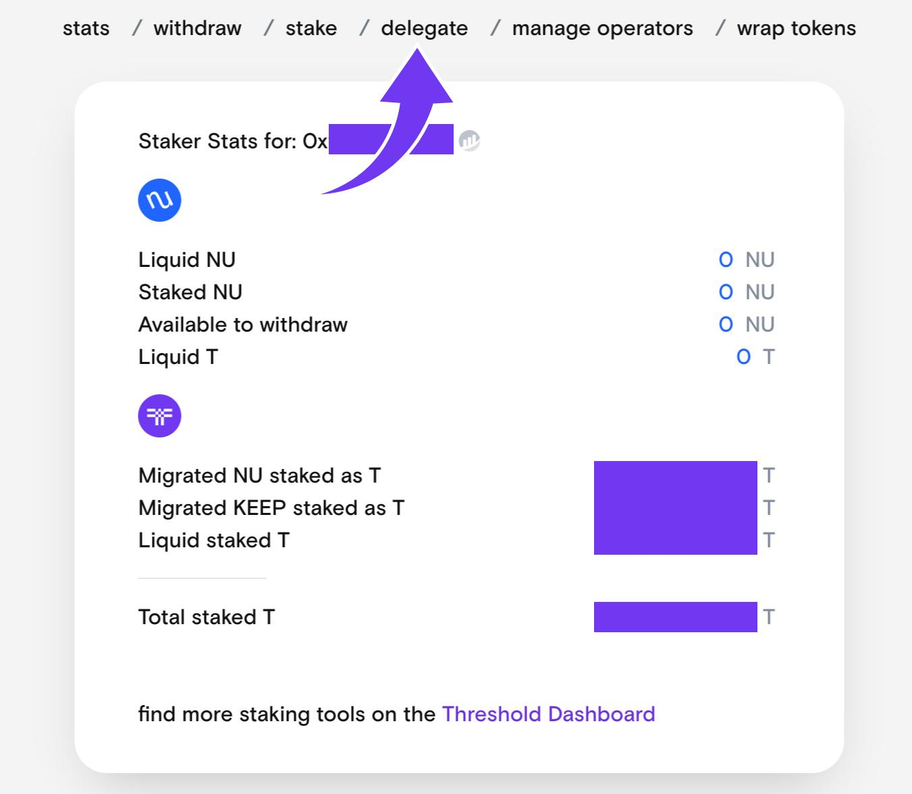

# Stake Weight Delegation

Stakers on Threshold can delegate their stake weights to themselves or a third party for voting on governance proposals.


Delegation is accomplished via an on-chain transaction which costs ETH.


1. Go to [https://stake.nucypher.network/manage](https://stake.nucypher.network/manage)&#x20;

2\. Connect your wallet

3\. Click on the _"delegate"_ tab in the navigation bar

4\. Enter the delegate address - once an address is entered, a _“Delegate”_ button will appear

5\. Click _"Delegate"_ and sign the transaction.

