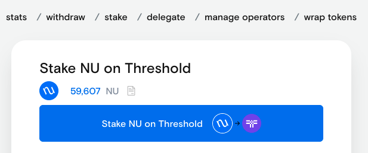
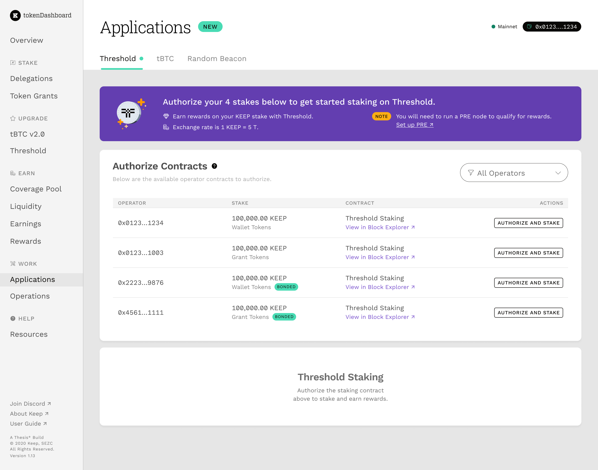

# Staking on Threshold

Stakes on Threshold can take the following forms:

* T stake using liquid T created on the [Threshold Dashboard](https://dashboard.threshold.network/staking)
* Legacy NU stake migrated to T from the [NuCypher Dashboard](https://stake.nucypher.network/manage)
* Legacy KEEP stake migrated to T from the [Keep Dashboard](https://dashboard.keep.network/applications/threshold)

Here is a summary of the overall process:

## Stake Liquid T

* Go to [https://dashboard.threshold.network/staking](https://dashboard.threshold.network/staking)
* Connect your wallet
* Your T balance will be shown - click on _"Stake"_
* There will be a pop-up describing the staking process; click the check-box to acknowledge you have read the requirements
* Choose an amount of T to stake and confirm the transaction

## Migrate Legacy NU Stake

* Go to [https://stake.nucypher.network/manage/stake](https://stake.nucypher.network/manage/stake)
* Click _"Stake NU on Threshold"_

## Migrate Legacy KEEP Stake

* Authorize Threshold Staking for the Keep Network legacy stake - [https://dashboard.keep.network/applications/threshold](https://dashboard.keep.network/applications/threshold)

