# PRE Node Setup


This document will help you get a node running to which you can bond your stake. **Please note that running a node is not a passive activity**.


Nucypher-ops is an ansible script that will setup and configure a PRE node for you. Currently, the script supports AWS and Digital Ocean. This document will guide you through the setup process using visuals from DigitalOcean.

## Local Machine Considerations



Install Ubuntu 20.04.4 LTS through the Windows Store:

<figure>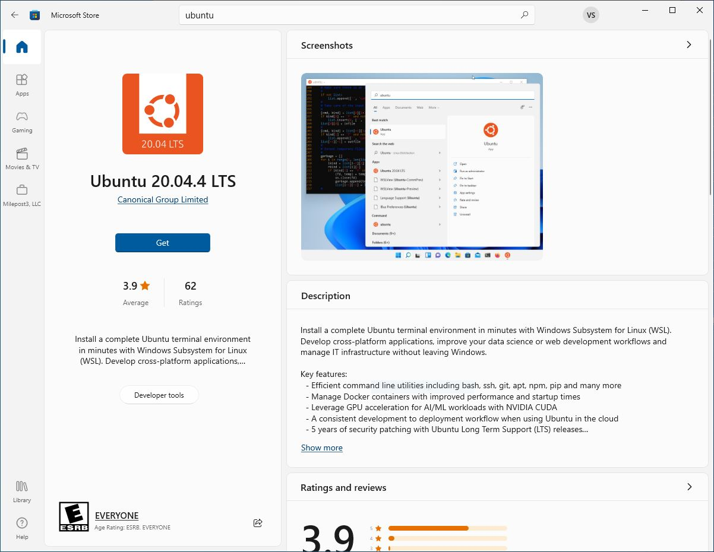<figcaption><p>WSL is the most convenient way to run nucypher-ops on a Windows based local machine</p></figcaption></figure>

To begin, update your local machine and install dependencies


```bash
sudo apt update
sudo apt upgrade
sudo apt-get install libffi-dev python3-dev python3-pip python3-virtualenv build-essential libssl-dev
```


Read prompts and respond appropriately. This will take a few minutes.



Install Python and pip on your local machine, if you don't have it already:

&#x20;**Python Website**

Visit the [Python.org Website](https://www.python.org/downloads/macos/)&#x20;

**PyPA Website**

Visit the [pypa.io Website](https://pip.pypa.io/en/stable/getting-started/)  and follow the steps provided to make sure that you have a working Python with pip installed.



To begin, update your local machine and install dependencies


```bash
sudo apt update
sudo apt upgrade
sudo apt-get install libffi-dev python3-dev python3-pip python3-virtualenv build-essential libssl-dev
```


Read prompts and respond appropriately. This will take a few minutes.



## SSH Key

Generate an SSH key pair. We will need the **public key**.&#x20;

Visit the [OpenSSH](https://www.openssh.com/)  website to learn about OpenSSH.

```
ssh-keygen -t rsa
 cat .ssh/id_rsa.pub
```

<figure>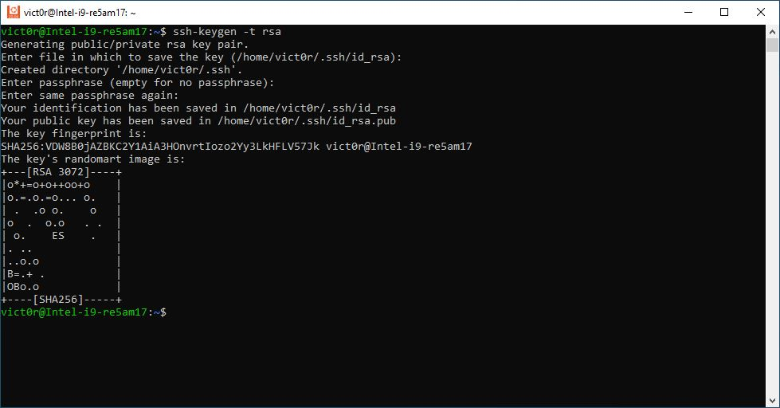<figcaption><p>Generating a new SSH Key</p></figcaption></figure>

Copy the highlighted part

<figure>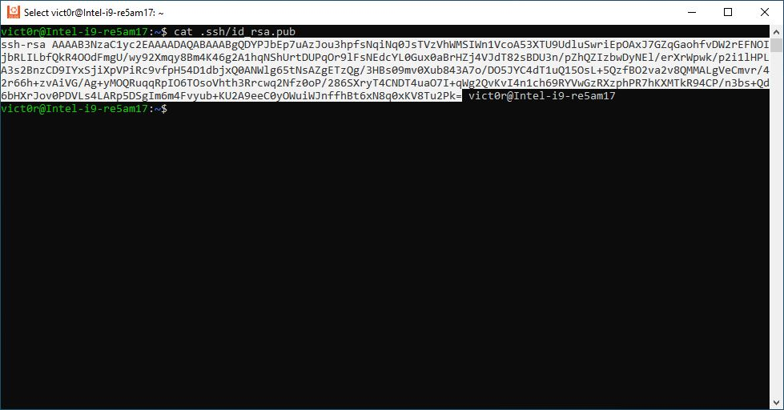<figcaption><p>New SSH Key</p></figcaption></figure>

In your Digital Ocean dashboard:

Go to **Settings** > **Security** and click the **Add SSH Key** button.

<figure>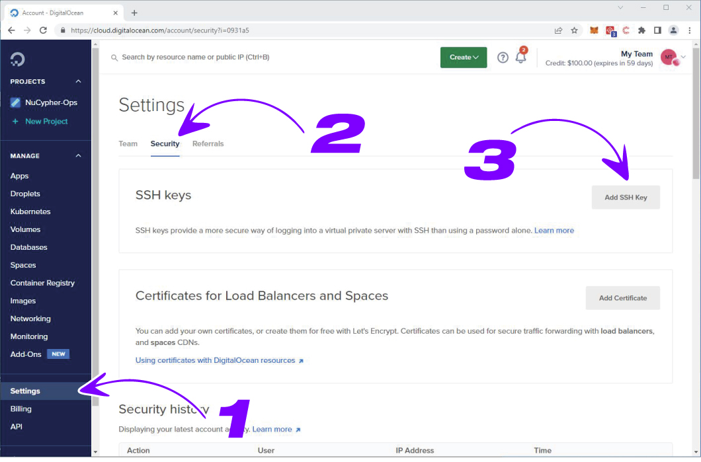<figcaption><p>Adding a new SSH Key</p></figcaption></figure>

Paste the key into the box, give your key a name, and click the **Add SSH Key** button.

<figure>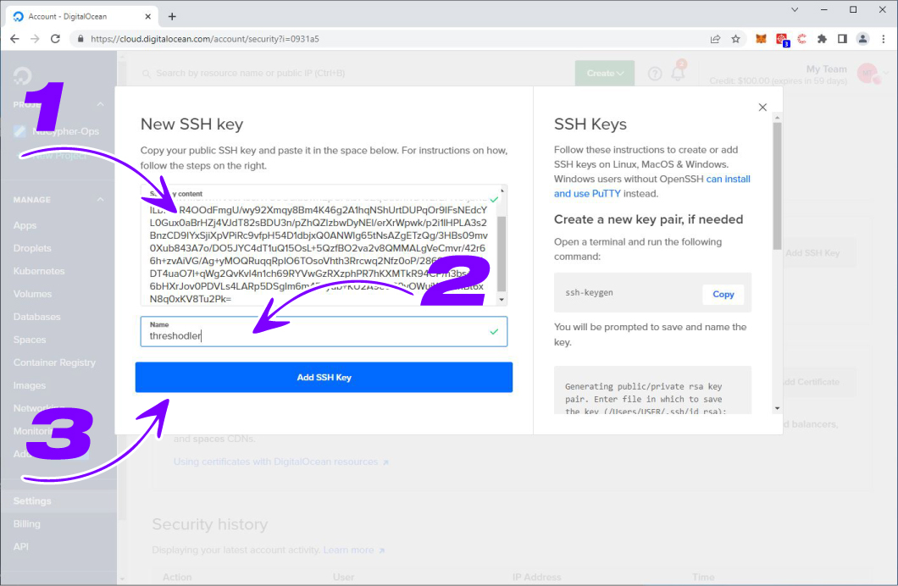<figcaption><p>Adding a new SSH Key</p></figcaption></figure>

Open a Text Document to make notes. Copy the SSH Fingerprint into this text file.


Do not share the fingerprint with anyone. Save and store in a secure place such as a password manager.


<figure>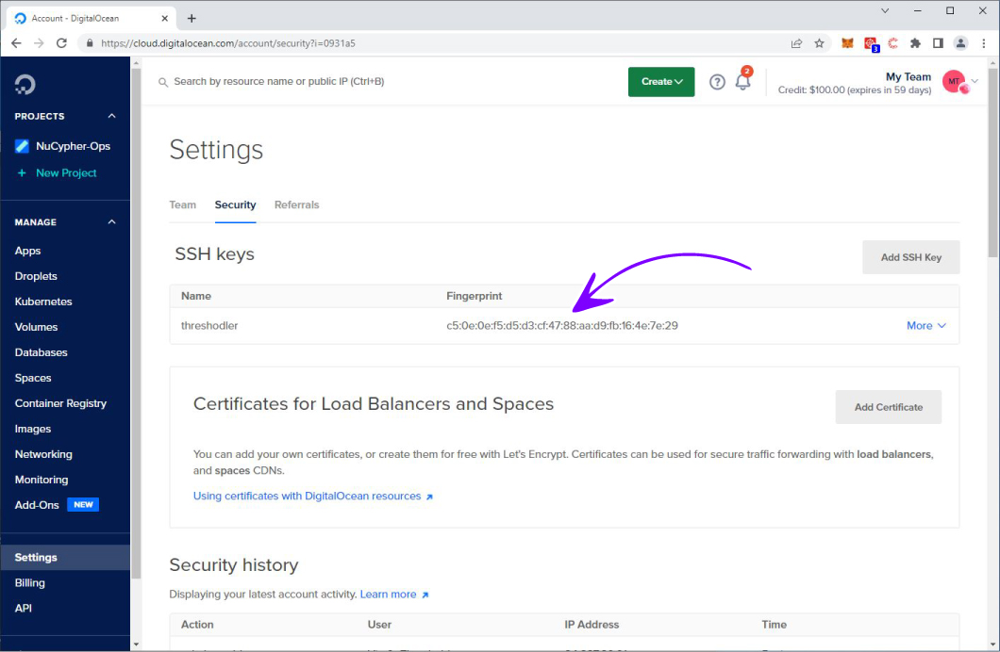<figcaption><p>SSH Fingerprint</p></figcaption></figure>

While we're here, let's create an API key as well. Go to **API** > **Tokens/Keys** and click the **Generate New Token** button.

<figure>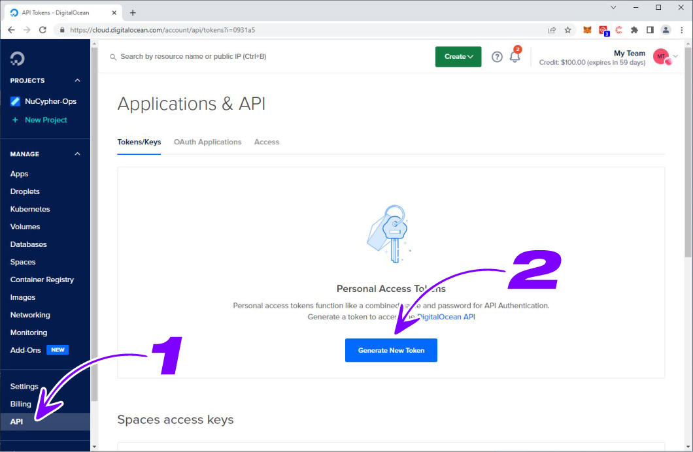<figcaption><p>Generating an API Access Token</p></figcaption></figure>

Name your token and click the **Generate New Token** button.


Unless you plan to periodically refresh this token yourself, you can set "Expiration" to NEVER


<figure>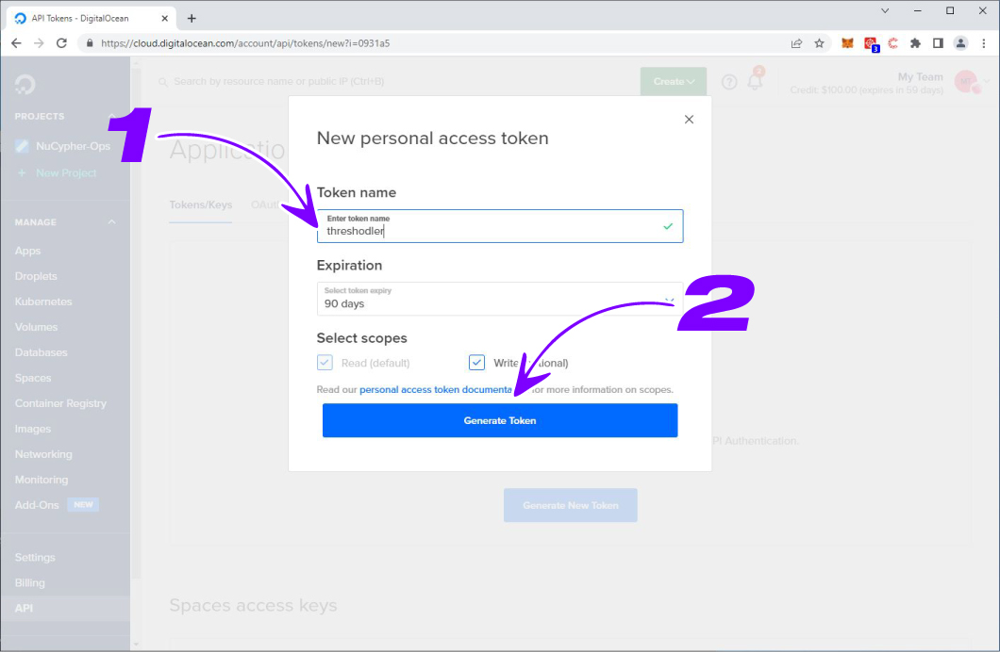<figcaption><p>Generating an API Access Token</p></figcaption></figure>

Copy the API Key into your Text file or password manager.

<figure>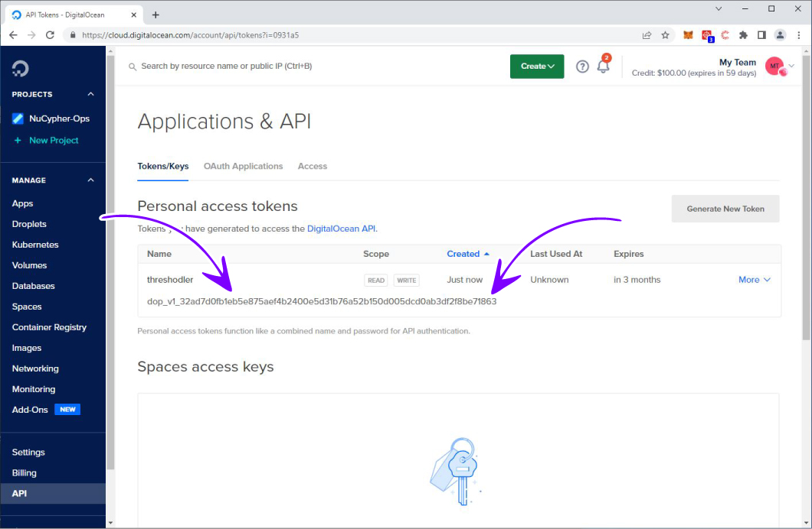<figcaption><p>Generating an API Access Token</p></figcaption></figure>

## L2 Providers

The PRE application requires access to an Ethereum endpoint, as well as a Polygon endpoint. One solution is to use a provider such as [Infura](https://infura.io/), [Quicknode](https://www.quicknode.com/), or [Alchemy](https://www.alchemy.com/). Each has their own pros and cons. Review them carefully.

Once you have made your decision(s) and signed up for an account, login to your account and setup an endpoint for Ethereum. The setup steps are very straightforward for each provider.

Make sure you select **Mainnet** for each endpoint. You will receive what looks like a https web address, Infura calls it an Endpoint, Quicknode refers to it as a Web3 endpoint. Make sure that the endpoint you copy starts with https.

Copy each of the endpoints to your text document or into your password manager. We will use them shortly.


Do NOT share your provider addresses with anyone.


### Checklist

Let's review and make sure you have everything needed to be successful:

* SSH key pair fingerprint
* API Access token
* Endpoint URL for Ethereum
* Endpoint URL for Polygon

<figure>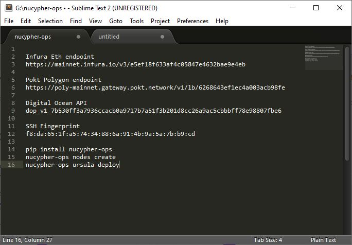<figcaption><p>Sample text file</p></figcaption></figure>

These items should be kept readily available.

### Installing `nucypher-ops`

```bash
pip install nucypher-ops
```

This will download the utility, and install dependencies. This process will take several minutes.

<figure>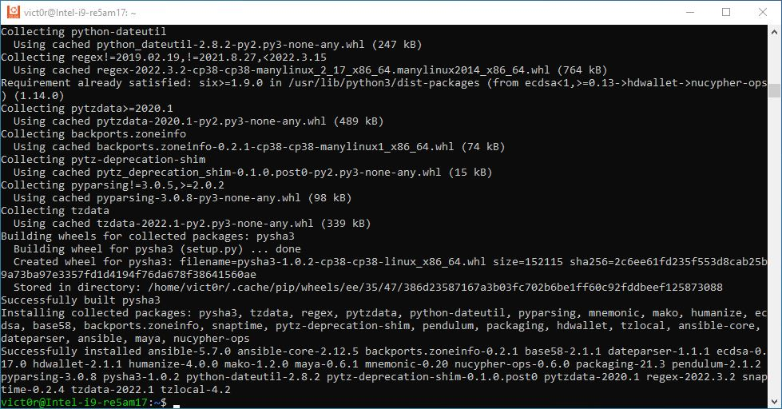<figcaption><p>nucypher-ops installation</p></figcaption></figure>

### Creating Your Node

Execute the following and be ready to answer questions from the utility:

```bash
nucypher-ops nodes create
```

This will connect to your Digital Ocean account, spin up a VPS, configure and secure it, and install all of the necessary software for you.

The utility will ask which provider you are using. Answer accordingly and press **ENTER**.

<figure>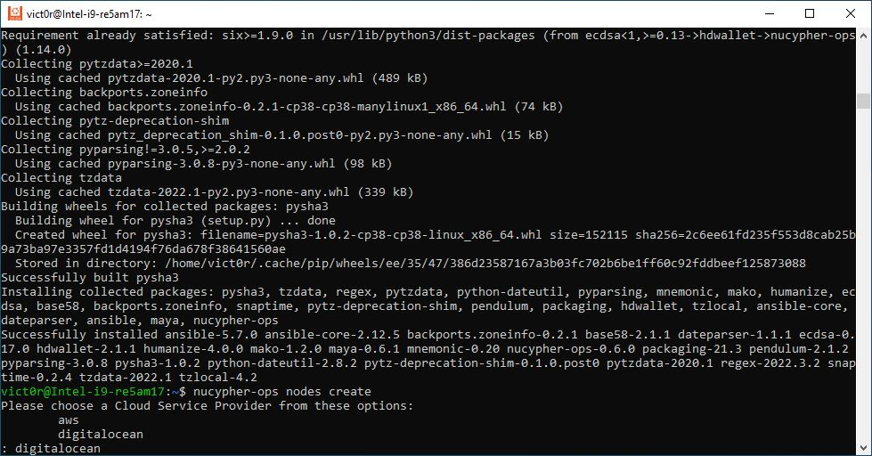<figcaption><p>Selecting VPS provider in nucypher-ops</p></figcaption></figure>

Provide your API Key and press **ENTER**.

<figure>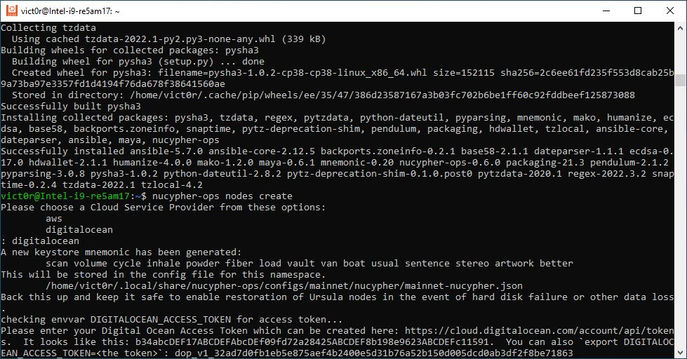<figcaption><p>Providing API Key in nucypher-ops</p></figcaption></figure>

Provide your SSH Fingerprint and press **ENTER**.

<figure>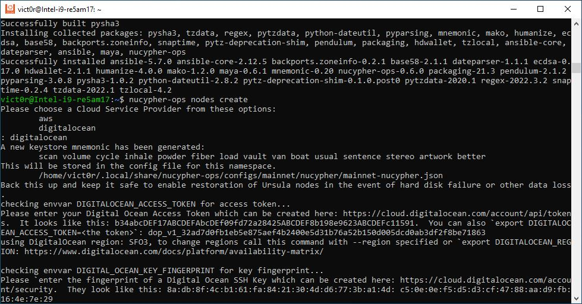<figcaption><p>Providing SSH fingerprint in nucypher-ops</p></figcaption></figure>

Then be patient.

<figure>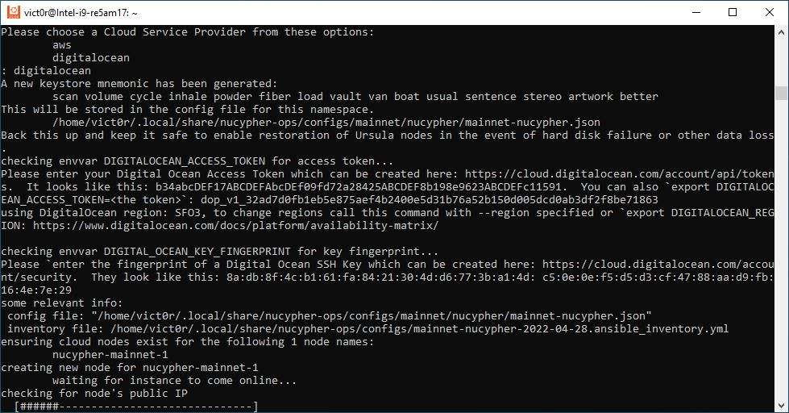<figcaption><p>Creating VPS instance &#x26; PRE node</p></figcaption></figure>

<figure>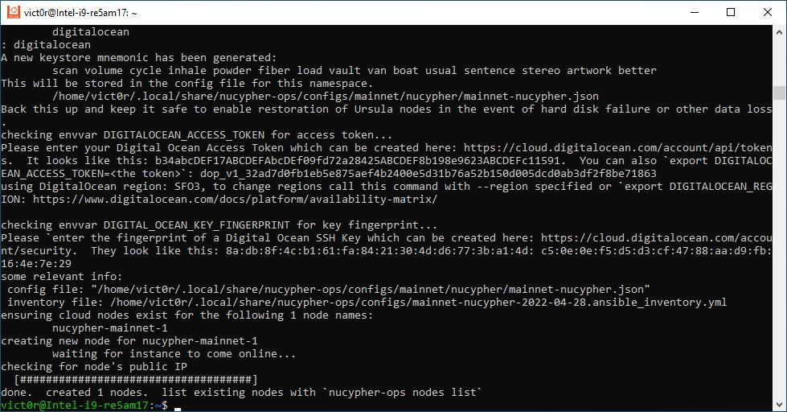<figcaption><p>VPS instance &#x26; PRE node created</p></figcaption></figure>

### Deploying Ursula

In a few minutes, you'll be ready to bond your stake.

```bash
nucypher-ops ursula deploy
```

Provide your ETH endpoint when requested and press **ENTER**.

Provide your Polygon endpoint when requested and press **ENTER**.

<figure>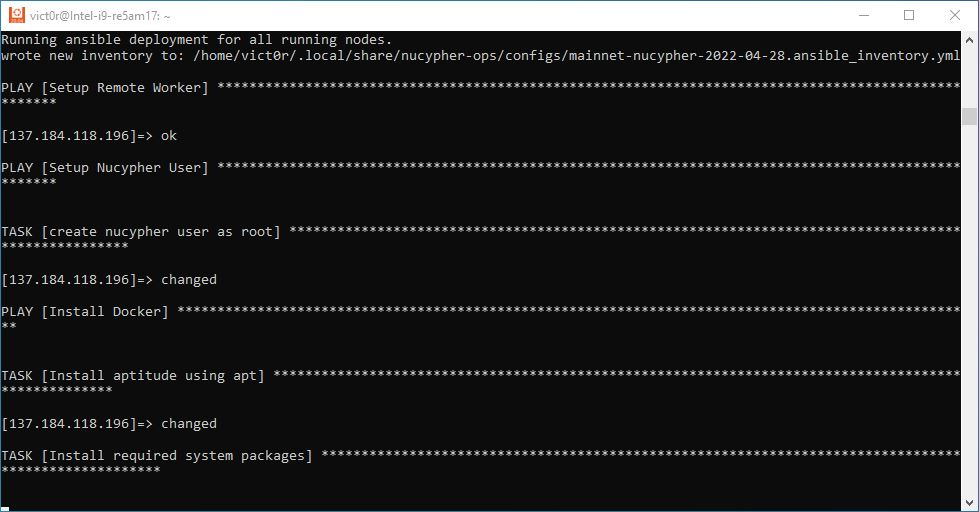<figcaption><p>Configuring and deploying Ursula</p></figcaption></figure>

Wait for it...

<figure>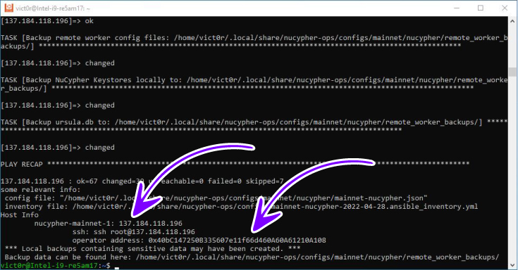<figcaption><p>PRE node ready to bond</p></figcaption></figure>

The items at the bottom are your node's IP address and Operator address, to which you will need to bond your stake.

To bond your stake to your new PRE node, click below:


Bonding UI link



Make sure you take note of your operator address.


## Nucypher-Ops Config File location

Nucypher-ops is a convenient tool for deploying a PRE node on the Threshold network. In case you need to make changes to the configuration of the utility on your local machine, these are the default directories where config files are stored locally:



```bash
~/.local/share/nucypher-ops
```



```bash
~/Library/Application Support/nucypher-ops
```




Caution: Do not make changes to these files without making a backup of them first. Do not make changes to these files unless you know and understand what you are doing.



Caution: Breaking these files may lead to your node becoming permanently inaccessible. Use extreme caution.


## Post Install

To find out about other features try

```bash
nucypher-ops --help
```

if you need to update your node to a new version of NuCypher just execute

```bash
nucypher-ops ursula update
```


Keep in mind staking is an active process, and that you are responsible for operational security, as well as backing up any relevant data. Carefully review your firewall rules and make necessary adjustments. `nucypher-ops` configures a PRE node, it does not setup security measures.

