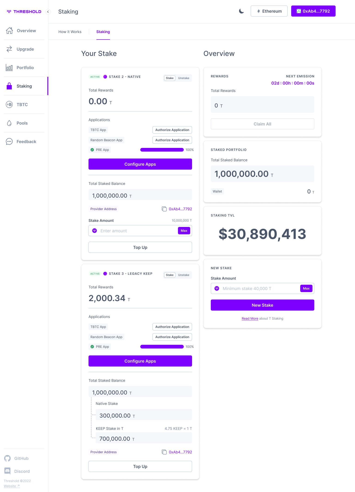
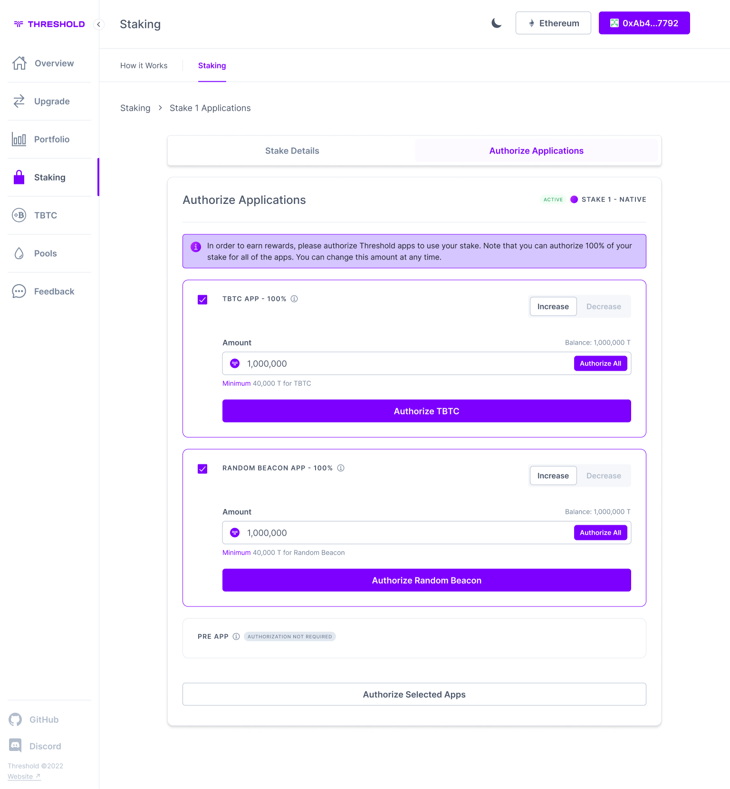
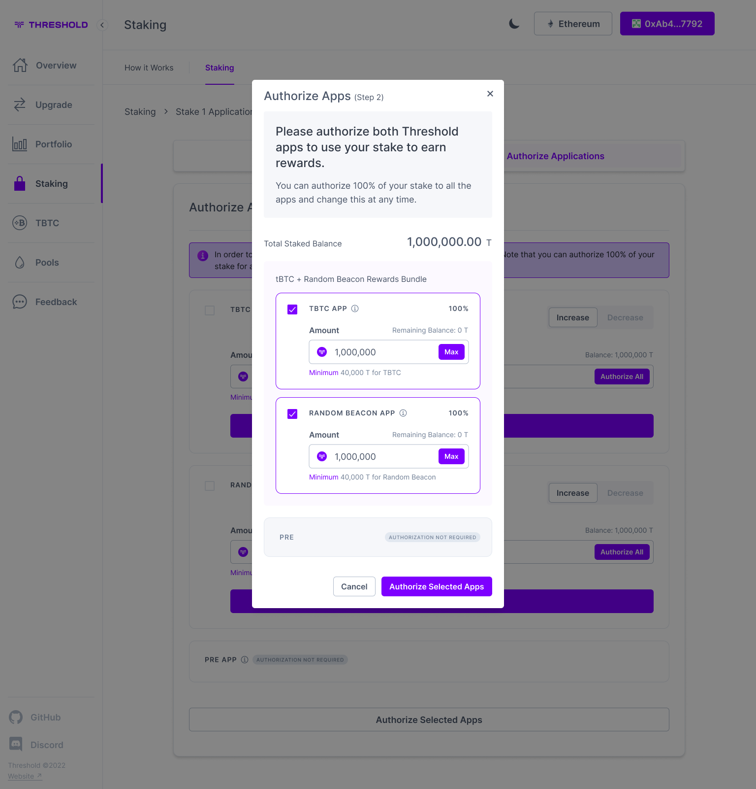
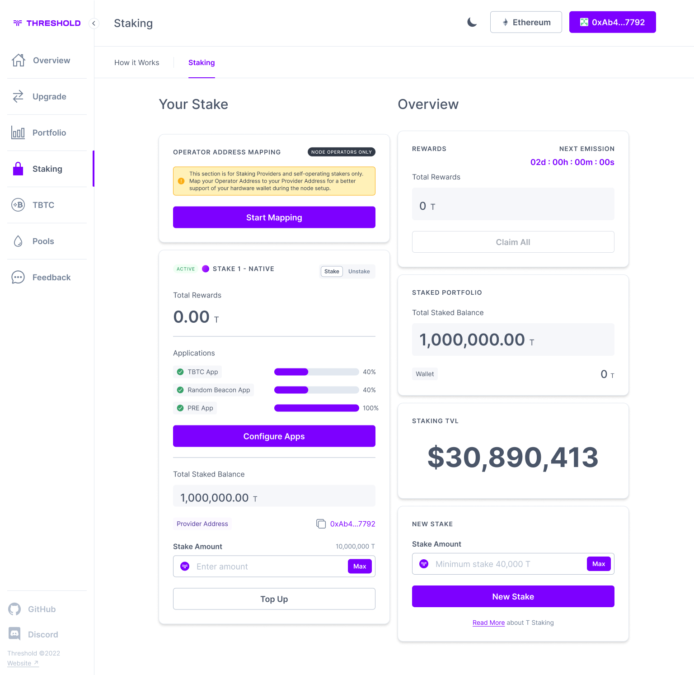
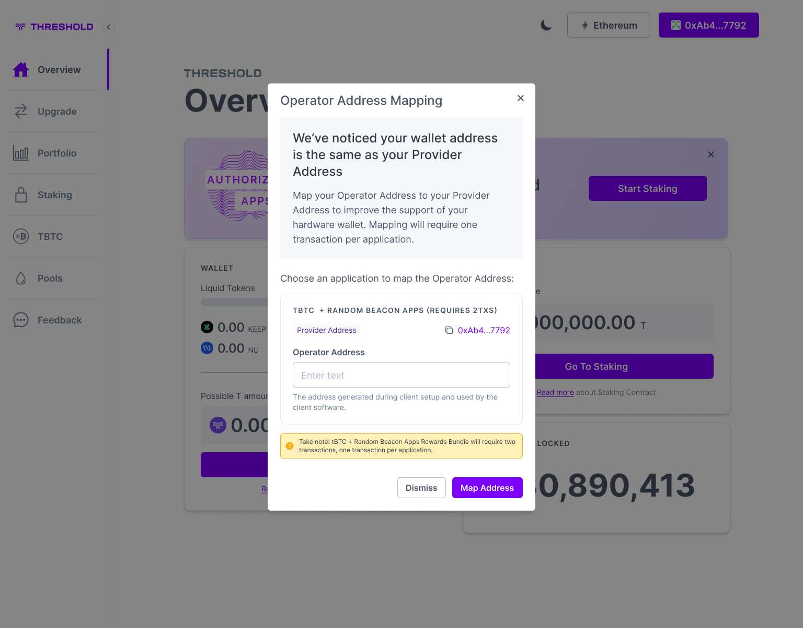

# Testnet tBTC v2 node Setup


This is a TESTNET guide document. Following this document will not result in a node enabling you to earn mainnet rewards.&#x20;


## Recommended Machine Types <a href="#recommended_machine_types" id="recommended_machine_types"></a>


While it is possible to run the client on a local machine, this is not recommended.


Your operating environment will ultimately dictate what machine type to go with. This is particularly relevant if you’re running a containerized solution where multiple applications are sharing VM resources. The below types are sufficient for running one instance of the tBTC v2 Node.

The preferred OS is Ubuntu.

| VPS Provider | VPS Type                                     |
| ------------ | -------------------------------------------- |
| AWS          | c5.large                                     |
| Azure        | F2s v2                                       |
| Google Cloud | n2-highcpu-2                                 |
| Self-hosted  | 2 vCPU / 2 GB RAM / 1 GiB Persistent Storage |

## **Ethereum API**

A Keep Node requires a connection to a WebSocket Ethereum API. You should obtain a WS API URL from a service provider (e.g. [Alchemy](https://www.alchemy.com/), [Infura](https://www.infura.io/), [Ankr](https://www.ankr.com/rpc-service/)) or run your own Ethereum node (e.g. [Geth](https://geth.ethereum.org/)).

The client requires an Ethereum Key File of an Operator Account to connect to the Ethereum chain. This account is created in a subsequent step using Geth (GoEthereum).

The Ethereum Key File is expected to be encrypted with a password. The password has to be provided in a prompt after the client starts or configured as a `KEEP_ETHEREUM_PASSWORD` environment variable.

The Operator Account has to maintain a positive Ether balance at all times.&#x20;


Please do NOT reuse an operator account that is being used for PRE or other applications.&#x20;


## Install Geth (GoEthereum)

To create a new Ethereum account, [install Geth](https://geth.ethereum.org/docs/install-and-build/installing-geth#ubuntu-via-ppas) (GoEthereum) and create a new account using the command below. This account will subsequently be referred to as the Operator Account.

<pre class="language-bash"><code class="lang-bash"><strong>geth account new --keystore ./operator-key
</strong></code></pre>

When prompted, provide a password to protect the operator key file.&#x20;


Use a password manager to generate a strong password and store it safely. It will be needed again during setup.



Avoid passwords that contain the following characters: ', ", \`, $\
These characters may be interpreted as part of the configuration which can lead to undesirable outcomes that may be extremely time intensive to correct.


Once the process completes, your public key will be displayed. Take note of your Operator Account public key.


DO NOT LOSE THE PASSWORD TO THE OPERATOR ACCOUNT.


### Funding your Operator Account

Your Operator Account will need to be funded with sepolia ETH and maintain a positive balance at all times to ensure proper operation and availability of your tBTC v2 node.

## Network Configuration

The node has to be accessible publicly to establish and maintain connections with bootstrap nodes and discovered peers.


Update firewall rules as necessary, including application level firewalls.


The node exposes metrics and diagnostics services for monitoring. A network port has to be exposed publicly, so the peers can connect to your node. A Diagnostics Port has to be exposed publicly, for the rewards allocation.

| Purpose | Config Property | Protocol | Default |
| ------- | --------------- | -------- | ------- |
| Network | network.port    | TCP      | 3919    |
| Status  | clientInfo.port | TCP      | 9601    |


A Diagnostics Port has to be exposed publicly, for the rewards allocation.


### **Announced Addresses**

An Announced Address is a layered addressing information (`multiaddress`/`multiaddr`) announced to the Threshold Network that is used by peers to connect with your node, e.g.: `/dns4/bootstrap-0.test.keep.network/tcp/3919` or `/ip4/104.154.61.116/tcp/3919`.

If the machine you’re running your node is not exposing a public IP (e.g. it is behind NAT) you should set the `network.AnnouncedAddresses` (flag: `--network.announcedAddresses`) configuration property to an addresses (`ip4` or `dns4`) under which your node is reachable for the public.

To read more about `multiaddress` see the [libp2p docummentation](https://docs.libp2p.io/reference/glossary/#multiaddr).


One important step to get your node operating on the Threshold Network is proper application authorization as well as operator account registration. Applications need only be authorized once.


It is **CRITICALLY** important that both the tBTC application as well as the Random Beacon applications are authorized. A node cannot be deployed without both applications being properly authorized.



**Please note:** by authorizing these applications, an unbonding period of 45 days will go into effect on the T you stake for these applications. This cool-down period begins the day you submit an unstake request.


## Application Authorization

To get started, visit the Threshold Dashboard and connect your wallet.

<figure><figcaption><p>Threshold Dashboard</p></figcaption></figure>

Click on "Configure Apps"

<figure><figcaption><p>Authorizing Threshold Applications</p></figcaption></figure>

Select BOTH tBTC and Random Beacon applications and enter your desired amount of T to stake per application. Note that the minimum is 40,000T.

<figure><figcaption><p>Authorizing Threshold Applications</p></figcaption></figure>

## Operator Registration

The operator account is the Ethereum account created on your node. In order for the network to associate your T stake with your node, you must register your Operator Address.&#x20;


An Operator for the Provider registration can be submitted just once. The Operator address assignment cannot be updated.


<figure><figcaption><p>Registering Operator Address</p></figcaption></figure>

After both applications have been authorized, click on "Start Mapping" to begin the Operator Registration process.

<figure><figcaption><p>Registering Operator Address</p></figcaption></figure>

Enter your Operator Address in the field provided and click on "Map Address."

Once the steps above have been successfully completed, you are ready to move on to the next step in the node deployment process.


Don't forget: a tBTC v2 node will not be able to be deployed without successfully authorizing both the tBTC and Random Beacon applications, and registering the node's operator address **FIRST**.


## Create Folder Structure

The client requires two persistent directories. These directories will store configuration files and data generated and used by the client. It is highly recommended to create frequent backups of these directories. Loss of these data may be catastrophic and may lead to slashing.


It is crucial to ensure the data directory is persisted and backed up on a regular basis.


#### Create folders for tBTC v2 client

```bash
cd /home
mkdir keep
cd keep
mkdir storage config
```

The tBTC v2 client will create two subdirectories within the storage directory: `keystore` and `work`. You do not need to create these.&#x20;

The `keystore` subdirectory contains sensitive key material data generated by the client. Loosing the `keystore` data is a serious protocol offense and leads to slashing and potentially losing funds.


It is the operator’s responsibility to ensure the keystore data are not lost under any circumstances.


The `work` directory contains data generated by the client that should persist the client restarts or relocations. If the `work` data are lost the client will be able to recreate them, but it is inconvenient due to the time needed for the operation to complete and may lead to losing rewards.

## **Copy Operator keystore file**

Assuming [Geth was installed](../operator-account.md) for the root user with the command provided in the [Operator Account creation](../operator-account.md) step, the operator-key file should be located in the `~/operator-key` directory.

```bash
cd ~/operator-key
```

Contained within the `operator-key` directory is the account key file (operator key file), its name will be similar to the following: \
`UTC--2018-11-01T06-23-57.810787758Z--fa3da235947aab49d439f3bcb46effd1a7237e32`

copy (not move!) this account key file to the `config` directory created above

```bash
ls -la
cp name_of_account_key_file /home/keep/config/name_of_account_key_file
```

## Install Docker

Install or update Docker to the latest version. Visit the [Official Docker website](https://docs.docker.com/engine/install/ubuntu/) for detailed instructions. Use the command below to find  your installed version if needed:

```bash
docker --version
```

## Docker Launch Script

To launch the tBTC v2 client, several configuration flags and environmental values need to be set. For simplicity, a bash script can be used rather than typing or pasting all the flags into the console.

Create the launch script:

```
nano keep.sh
```

And paste the following:

```bash
# Keep Testnet tBTC v2 Client
#
# Ethereum endpoint WebSocket URL
# This can be a provider such as Infura, Alchemy, Ankr, etc or your own Geth Nodeq
# ETHEREUM_WS_URL="wss://sepolia.infura.io/ws/v3/redacted_credentials"
# note: only replace characters inside the " ". The Quotation marks must be retained
ETHEREUM_WS_URL="<Ethereum API WS URL>"

# copied to home/keep/config earlier
OPERATOR_KEY_FILE_NAME="<Operator Account keyfile name>"

# password set during Operator Account Address creation
OPERATOR_KEY_FILE_PASSWORD="<Operator Account keyfile password>"

# To configure your node with a Public IP, enter it below.
PUBLIC_IP="<PUBLIC_IP_OF_MACHINE>"
# Alternatively, you can use DNS.
# To configure DNS, modify the last line of the script
# and add your DNS in the following format:
# /dns4/bootstrap-1.test.keep.network/tcp/3919

# Setup configuration and storage directories
# THESE MUST BE PERSISTENT STORAGE
CONFIG_DIR="/home/keep/config"
STORAGE_DIR="/home/keep/storage"

docker run \
    --detach \
    --restart on-failure \
    --volume $CONFIG_DIR:/mnt/keep/config \
    --volume $STORAGE_DIR:/mnt/keep/storage \
    --env KEEP_ETHEREUM_PASSWORD=$OPERATOR_KEY_FILE_PASSWORD \
    --env LOG_LEVEL=info \
    --log-opt max-size=100m \
    --log-opt max-file=3 \
    -p 3919:3919 \
    -p 9601:9601 \
    us-docker.pkg.dev/keep-test-f3e0/public/keep-client \
    start \
    --testnet \
    --ethereum.url $ETHEREUM_WS_URL \
    --ethereum.keyFile /mnt/keep/config/$OPERATOR_KEY_FILE_NAME \
    --storage.dir /mnt/keep/storage \
    --network.announcedAddresses /ip4/$PUBLIC_IP/tcp/3919

```

Save and close the file, and make it executable:

```bash
sudo chmod +x keep.sh
```

To launch the tBTC v2 client, execute:

<pre class="language-bash"><code class="lang-bash"><strong>sudo bash keep.sh
</strong></code></pre>


The `--detach` property will prevent the status messages from the client to be printed to the console. Review the Docker logs for detailed status information.



The path shown in the example configuration will differ from yours. Make sure it is configured correctly.


## Client Startup

Unless the `--detach` flag was removed from the startup script, there will be no console output. In order to check your node, retrieve the Docker logs.

First, find your Docker instance identification, it'll be a random combination of words, e.g. `stinky_brownie`:

```bash
sudo docker ps
```

Use your specific identification and substitute:

```
sudo docker logs stinky_brownie >& /path/to/output/file
```

Scroll down about half a page, and you should see the following:

<pre><code><strong>
</strong>▓▓▌ ▓▓ ▐▓▓ ▓▓▓▓▓▓▓▓▓▓▌▐▓▓▓▓▓▓▓▓▓▓▓▓▓▓▓▓▓▓ ▓▓▓▓▓▓▓▓▓▓▓▓▓▓▓▓▓▓ ▓▓▓▓▓▓▓▓▓▓▓▓▓▓▓▓▓▄
▓▓▓▓▓▓▓▓▓▓ ▓▓▓▓▓▓▓▓▓▓▌▐▓▓▓▓▓▓▓▓▓▓▓▓▓▓▓▓▓▓ ▓▓▓▓▓▓▓▓▓▓▓▓▓▓▓▓▓▓ ▓▓▓▓▓▓▓▓▓▓▓▓▓▓▓▓▓▓▓
  ▓▓▓▓▓▓    ▓▓▓▓▓▓▓▀    ▐▓▓▓▓▓▓    ▐▓▓▓▓▓   ▓▓▓▓▓▓     ▓▓▓▓▓   ▐▓▓▓▓▓▌   ▐▓▓▓▓▓▓
  ▓▓▓▓▓▓▄▄▓▓▓▓▓▓▓▀      ▐▓▓▓▓▓▓▄▄▄▄         ▓▓▓▓▓▓▄▄▄▄         ▐▓▓▓▓▓▌   ▐▓▓▓▓▓▓
  ▓▓▓▓▓▓▓▓▓▓▓▓▓▀        ▐▓▓▓▓▓▓▓▓▓▓         ▓▓▓▓▓▓▓▓▓▓▌        ▐▓▓▓▓▓▓▓▓▓▓▓▓▓▓▓▓
  ▓▓▓▓▓▓▀▀▓▓▓▓▓▓▄       ▐▓▓▓▓▓▓▀▀▀▀         ▓▓▓▓▓▓▀▀▀▀         ▐▓▓▓▓▓▓▓▓▓▓▓▓▓▓▀
  ▓▓▓▓▓▓   ▀▓▓▓▓▓▓▄     ▐▓▓▓▓▓▓     ▓▓▓▓▓   ▓▓▓▓▓▓     ▓▓▓▓▓   ▐▓▓▓▓▓▌
▓▓▓▓▓▓▓▓▓▓ █▓▓▓▓▓▓▓▓▓ ▐▓▓▓▓▓▓▓▓▓▓▓▓▓▓▓▓▓▓ ▓▓▓▓▓▓▓▓▓▓▓▓▓▓▓▓▓▓  ▓▓▓▓▓▓▓▓▓▓
▓▓▓▓▓▓▓▓▓▓ ▓▓▓▓▓▓▓▓▓▓ ▐▓▓▓▓▓▓▓▓▓▓▓▓▓▓▓▓▓▓ ▓▓▓▓▓▓▓▓▓▓▓▓▓▓▓▓▓▓  ▓▓▓▓▓▓▓▓▓▓

Trust math, not hardware.
	
-----------------------------------------------------------------------------------
| Keep Client Node                                                                |
|                                                                                 |
| Version: Version: vX.X.XX (4d745f6d0)                                         |
|                                                                                 |
| Operator: 0x_your_operator_address                                              |
|                                                                                 |
| Port: 3919                                                                      |
| IPs : /ip4/111.222.333.444/tcp/3919/ipfs/redacted                               |
|                                                                                 |
| Contracts:                                                                      |
| RandomBeacon   : 0x2bA82903B635a96154A515488d2952E86D6adc3A                     |
| WalletRegistry : 0x2363cc10b7680000C02E4a7067A68d1788ffc86F                     |
| TokenStaking   : 0x69f962a0fbA5635e84eC94131f9072108E2E4F24                     |
-----------------------------------------------------------------------------------
</code></pre>

Congratulations, your node is up and running.&#x20;
