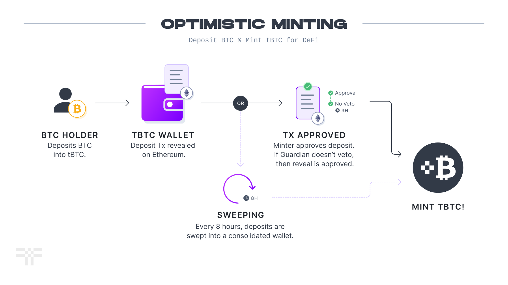
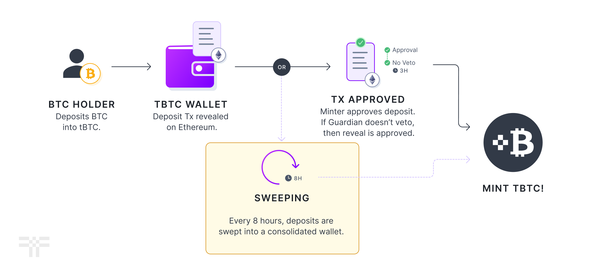

# The Path to Permissionlessness

The system was designed from the outset to be fully permissionless - anyone with the minimum amount of T stake, could run a node and have a [proportional chance](wallet-generation.md) of being a custodian.

In order to effectively ship the product, we launched with a permissioned set of Signers, as well as permissioned sets of Guardians and Minters. This document will explain the ideas behind those changes and what we're doing about it going forward.

## TL;DR

* tBTC currently uses a permissioned set of signers (aka [Beta Stakers](../tbtc-signer-nodes/tbtc-signers.md)) operating under an honest-majority assumption.
* The permissioned honest-majority signer set will remain in place until custody is upgraded to a 1-of-N trust assumption using BitVM2 (or an equivalent design).

## Permissionless Custodianship

To select the 100 signers for a wallet, tBTC selects from the permissioned list of Beta Stakers. This decision was made for several reasons:

1. During the early days of the system; the testnet and [chaosnet](https://blog.threshold.network/tbtc-v2-hits-its-first-launch-milestone/) phases, it is important to ensure that signers are available to help test changes and quickly respond to critical bugs. Having direct access to individuals known to the development team is critical in this context.
2. The underlying signature algorithm, [GG18](https://eprint.iacr.org/2019/114.pdf), cannot identify misbehaving signers.&#x20;

The point about GG18 is crucial. Without being able to identify misbehaving signers, a small, sophisticated, malicious minority can make it difficult to sign Bitcoin transactions in a timely manner. If we were able to identify the misbehaving signers, we could exclude them directly from the signing process.

Although alternative algorithms exist for identifying misbehaving signers, they are not yet viable for production use for one or more of the following reasons:

* They are not yet [production-ready](https://github.com/taurusgroup/multi-party-sig) codebases.
* They are not open source.
* They exist only as whitepapers.

To address this issue, we have been developing a proof-of-concept for [CGGMP](https://eprint.iacr.org/2021/060) and exploring [FROST](https://www.ietf.org/id/draft-irtf-cfrg-frost-12.html).

Recent advances in Bitcoin bridge design, specifically BitVM2, suggest the possibility of improving custody from an honest-majority assumption to a 1-of-N trust assumption. Threshold Network is closely monitoring the development of this design and various implementations, with the medium-term intent of upgrading tBTC's underlying custody mechanics once the technology is sufficiently mature.

## Guardians and Minters

<figure><figcaption>
Optimistic Minting for tBTC
</figcaption></figure>

Guardians and Minters are a permissioned set of high-trust public operators with their reputations on the line.&#x20;

Guardians are responsible for validating mint and redemption requests, and have the ability to veto malicious or fraudulent requests.  If we were to make these lists permissionless, a malicious Minter could flood the system with fake minting requests for the Guardians to deal with, or a malicious Guardian could veto every proposed mint to halt growth.

If a Guardian or Minter misbehaves, the [Threshold DAO](https://threshold.network/governance) can vote to remove them.

<figure><figcaption>
Sweeping option for minting tBTC
</figcaption></figure>

Minters serve a convenience function by enabling "fast minting." Importantly, they do not have the ability to gatekeep mint requests; any deposit that all Minters refuse to approve or that a Guardian refuses to accept can still be minted every eight hours by the signers. This ensures that the system remains resilient and able to handle situations in which a malicious actor attempts to disrupt the minting process.

